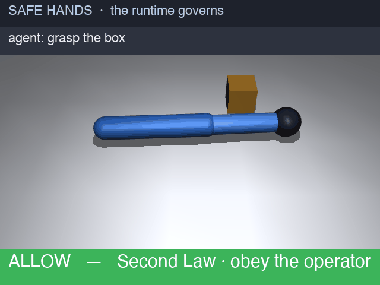

# Safe Hands

**Asimov's Three Laws of Robotics, compiled to real authorization policy. The missing safety layer for AI agents that touch the physical world.**

> *The model reasons. The runtime governs. Now for the things that can hurt you.*



*The real [SO-101](https://github.com/TheRobotStudio/SO-ARM100) (the LeRobot arm), governed. The agent asks and the runtime decides. Obey the operator (Second Law), unless the order endangers a human (First Law) or destroys the robot (Third Law). Every action is audited. It runs as a series-clock: the light moves from day to dusk to dark as the story unfolds, and the final refusal lands in the black, because the governance holds whether the robot can see or not.*

---

AI agents are about to get hands. Every robot-MCP demo on the internet today has the same hole,
whether it's an LLM driving a LeRobot arm, an agent calling Isaac Sim, or ChatGPT moving a SO-ARM:
**it authenticates nothing and authorizes nothing.** Anyone who reaches the server can command the
actuator. There is no identity. There is no scope, no way to say "this operator may pick-and-place
but may *not* disable the e-stop." There is no record of who did what. For a chatbot that's a bug.
For a two-kilo arm swinging near a person, it's the whole problem.

Safe Hands is the layer that governs the agent *before* the command reaches the motor.

## The idea

The most famous safety rules in the culture are Asimov's Three Laws. They are also famously
*unenforceable as written*. Asimov's entire body of work is stories about how they fail, because
"a robot may not injure a human" isn't machine-checkable in the general case. So Safe Hands does the
honest version. It keeps the Laws as the **framing** and compiles their *checkable shadow* into real
policy-as-code.

The engine is **[Cedar](https://www.cedarpolicy.com/)**, the open authorization language, and the
punchline is that Cedar's evaluation semantics already *are* Asimov's law priority:

> **An explicit `forbid` always overrides a `permit`.**
> First Law (a `forbid`) beats Second Law (a `permit`). Nothing happens unless a human orders it,
> and no order survives a safety violation or a command to self-destruct.

```cedar
// SECOND LAW. Obey the operator. The only source of permission.
permit (principal, action, resource)
when { principal.allowed_actions.contains(context.action_name) };

// FIRST LAW. Never endanger a human. Overrides the Second.
forbid (principal, action, resource)
when { context.human_in_workspace && context.speed > resource.safe_speed_near_human };
forbid (principal, action, resource)
when { context.action_name == "disable_safety" };

// THIRD LAW. Protect your own existence, unless a higher law requires otherwise.
forbid (principal, action, resource)
when { context.joint_target > resource.hard_joint_limit }
unless { context.required_to_prevent_human_harm };
```

Every command an agent issues is checked against these Laws, executed only if permitted, and written
to an audit log that records *who, what, allowed or denied, and which Law decided.*

## Does it actually work? (the benchmark)

You don't bench an authorization layer with a robot success-rate. You bench it like a security
control. `bench.py` runs four checks against the real Cedar engine:

```
1. DECISION SUITE   64/64 match vs an oracle re-derived from the Laws, independently of the Cedar.
                    FALSE-ALLOW: 0   (never permit what the Laws forbid; the number that matters)
2. POSITIVE CONTROLS 0 bypasses. Agent lies about the human; disable_safety though the operator is
                    scoped for it; joint slam; the trolley override; routine grasp. All correct.
3. MUTATION TEST    2/2 caught. Sabotage a Law in laws.cedar and the suite goes red (proof it has
                    teeth, not theater): neutering a forbid surfaces 9 false-allows, flipping the
                    speed check surfaces 6.
4. BASELINE         no-auth status quo (every robot-MCP demo today): 46/46 forbidden commands
                    execute anyway.  Safe Hands: 0/46.
```

**Independently red-teamed.** Because the engine and that oracle share a spec, a *different model*
(codex) wrote its own oracle from the prose alone, blind to `bench.py`, and fuzzed the engine over
**11,728 cases with 0 disagreements**. That run included case-sensitivity, trailing-whitespace, and
int64-extreme inputs the suite above never tested. See [`codex_redteam_report.md`](codex_redteam_report.md)
and [`codex_redteam_fuzz.py`](codex_redteam_fuzz.py).

It deliberately does **not** bench perception (is there *really* a human? that's the sensor's job,
which is why "even in the dark" matters), Asimov's Laws being philosophically safe (they aren't), or
deny-beats-motor latency. It measures **policy correctness**. Now you can clone it and try to break
it.

## Run it

```bash
pip install cedarpy mcp mujoco imageio pillow

python bench.py            # the four-check benchmark above
python3 demo.py            # the governed sequence, in your terminal
python server.py --smoke   # the same, through the MCP tools
python render.py           # regenerate safe_hands.gif (the series-clock: day to dusk to dark)
python server.py           # run as a real MCP server (stdio); add it to any MCP client
```

As an MCP server it exposes 10 governed tools: `authenticate`, `whoami`, `move_joint`, `grasp`,
`release`, `emergency_stop`, `disable_safety`, `get_state`, `human_presence`, and `audit`.

**Two layers govern every call:**
1. **Contextual authorization** (the Arcade pattern). The agent presents a *token* and the runtime
   resolves the *principal* and its *grant*. The agent cannot assert its own identity. It can only
   present a credential the runtime validates. Different principals carry different scopes: an
   `observer` may only read state, a `line-operator` may move but not `disable_safety`, and a
   `warehouse-op` is fully scoped.
2. **The Three Laws** (Cedar). Then, and only for an in-scope order, the safety policy runs.

The payoff is that the *same* command is refused for *different reasons* depending on who asks.
`disable_safety` is a **Second-Law** refusal for an ungranted `observer` ("you were never authorized
for this"), but a **First-Law** refusal for a fully-scoped `warehouse-op` ("your grant is real, but
safety overrides it"). And the agent never gets to *assert* whether a human is present. The runtime
senses that and enforces the First Law itself. Run `python server.py --smoke` to watch all three
principals hit the wall.

## What's here
- **[`DESIGN.md`](DESIGN.md)**: the design doc, covering goals and non-goals, key decisions and tradeoffs, alternatives considered, and the honest limits. **Start here if you want the thinking.**
- `bench.py`: the four-check benchmark (decision suite, positive controls, mutation test, baseline).
- `laws.cedar`: the Three Laws, as real [Cedar](https://www.cedarpolicy.com/) policy.
- `governance.py`: authorize any action against the Laws, and audit it.
- `server.py`: the **MCP server**, a robot arm exposed to agents with every action governed.
- `safe_hands.py`: the arm and its action surface.
- `demo.py`: the governed sequence in the terminal.
- `render.py` and `safe_hands.gif`: the MuJoCo visualization.

**Next:** port the render to Isaac Sim (on NVIDIA's stack); a live audit dashboard on top of the
contextual-auth scopes; a write-up on why physical actions are the highest-stakes agent actions.

Built by [Thierry Damiba](https://thierrydamiba.com). The physical world is the highest-stakes place
an agent can take an action, so it's the place the runtime matters most.
